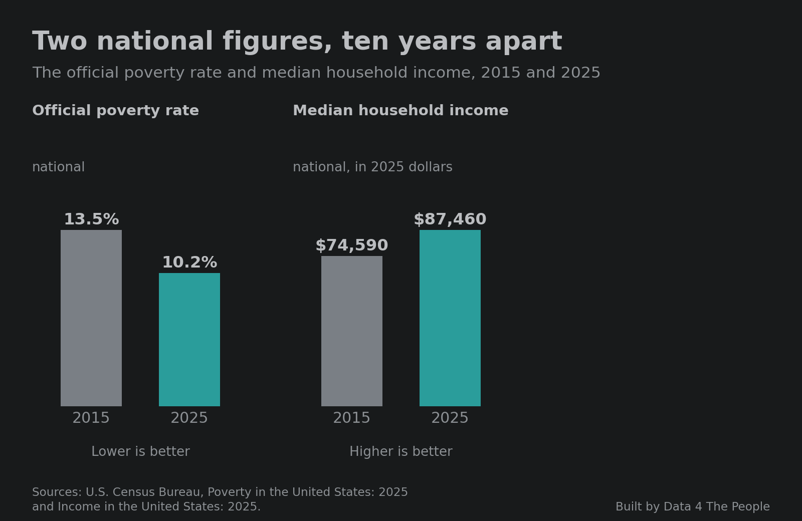

# The Single Income Stress Test: five takeaways

Today’s post highlights our five key takeaways from the [Single Income Stress Test](https://www.data4thepeople.com/p/stress-test-viz), the data visualization we re-released yesterday.

But rather than list those for you, I want to try something different with this post. I want to show you why it’s so critical to do this work.

To start, look at this image. How does it make you feel? Joyous? Peaceful? Calm? Maybe a bit jealous that you are not in this beautiful setting right now?

Notice how we create stories around what we see. This image feeds only so much information through our eyes and into our brains. But we humans have an amazing ability to build entire stories around incomplete information. Without knowing it, you may have created an entire story about this woman’s hike, or vacation, or life, filling in the pieces of the puzzle to make the story complete.

But now let’s pan the image to the right.

Now how do you feel about the situation? It’s a completely different story. No longer do we long to be in this woman’s position.

This exercise exposes a flaw in the way our brains work. We are storytelling machines. It’s how we evolved as a species, and why we dominate this planet (in my view). But we evolved in a world where all we had to base our stories on was our own experience. We didn’t have photos, or AI slop videos, or incomplete data, or algorithms. So, we couldn’t get ourselves in much trouble. Now we have all this noise, and our minds still want stories. They will happily build them out of noise.

Now, consider this finding we present in today’s post.

What story does your mind create about America from this data? To be clear, these are real data points. We confirmed them. No one is lying to you when they try to take credit for them.

Again, the problem is not the data. It is the story we create around it. So we need to stay curious and try to find more data to feed to our flawed minds to create a more complete story.

And so, we did that. Take a look at the third data point, which we unearthed in this analysis. It shows what has happened to the safety net that a family living on a single income has above the poverty threshold.

Now, that doesn’t line up with the first two data points, does it? Good. Our world is complex, and things rarely fit the story we tell ourselves once we see the full picture. This is the point of giving you data visualizations rather than static images. You see more, and you can build more nuanced stories in your mind. Hopefully those stories cause less trouble when they harden into dogma and are unleashed on the world.

Thanks for indulging us by reading this intro. We hope you enjoy today’s key takeaways post, and that you use it to build more complete stories about what it’s like to live on the threshold of poverty in America. We also hope you come back to this exercise as a reminder. Notice when your mind is recklessly creating a story from information fed to you, especially when the person or entity feeding it to you benefits from the story you are creating.

::: spacer

The Single Income Stress Test is a map that takes one person's annual pay, subtracts the local poverty threshold for their family, and subtracts money for surprise expenses, for every U.S. metro and rural area from 2015 to 2025. Here are five findings that grabbed our attention.

Note: Unless we say otherwise, the figures are for 2025, a median earner, and two adults and two children who rent. The test uses one job's pay before taxes, so read it as an illustrative Data 4 Thought experiment, not an official poverty measure.

## 1. The result turns on about $10,000

This first chart takes some explaining, so start with one city.

In the Cincinnati metro area, the median job paid $50,170 in 2025. The local poverty threshold for two adults and two children who rent was $38,265. That leaves $11,905. Call that the "safety net": what one paycheck has left over for surprise expenses once the family's most basic costs are covered.

Now set some money aside for surprise expenses. With $5,000 set aside, a family living on Cincinnati's median paycheck has a $6,905 safety net. With $10,000 set aside, it has $1,905. With $12,000 set aside, the family's pre-tax income no longer covers both, and that Cincinnati family would have to borrow, perhaps on a credit card, or go without.

Every area has a tipping point like that. The chart below runs the same test on all 521 areas at once.

One thing to know before reading it. Areas are not the same size. The New York area has about 9.5 million jobs, and Eagle Pass, TX has about 19,000. Counting areas would treat the two as equal. So the chart counts jobs. When an area falls short, all of its jobs go into the total.

Along the bottom is the money needed for surprise expenses, from $0 to $25,000. The line is the share of all U.S. jobs that are in areas that have fallen short by that amount.

Read it from left to right. If all goes as planned and there are NO surprise expenses anywhere in America, just 0.6% of jobs are in areas where a single income falls short of the poverty threshold. But that's not reality. So, add in $5,000 of surprise expenses and it is 15%. At $10,000 it is 49%. At $15,000 it is 87%, and at $20,000 it is 96%.

Take the middle point. With $10,000 set aside, one median paycheck falls short in 283 of the 521 areas, and those 283 areas hold 49% of the country's jobs. That does not mean 49% of workers fall short. It means that about half of U.S. jobs are in places where the middle paycheck for a single-income family does not cover the poverty threshold plus $10,000 of surprise expenses.

The line is steepest between $5,000 and $15,000 because that is where most areas' safety nets sit. In the typical area, the median paycheck clears the poverty threshold by $9,694, against Cincinnati's $11,905.

::: spacer

## 2. Below the median, there is no cushion to speak of

The median is the middle of the pay scale. The chart below runs the same test at five pay levels, with nothing set aside for surprises.

At the 25th percentile, pay is below the local poverty threshold in 418 of 521 areas, which hold 91.7% of the jobs. At the 10th percentile, it is below the threshold in all 521.

San Jose shows why studying the median alone is not enough. The chart below sets pay at five levels in the San Jose metro area against its poverty threshold, the highest on the map.

San Jose's median wage of $84,050 clears the threshold by $22,287. If you stopped here, San Jose would pass this test with flying colors. But its 25th percentile wage of $49,800 falls $11,963 short. That drop from the median to the 25th percentile, 41%, is the largest of the 387 metro areas. In the typical metro area it is 25%.

San Jose is not alone. Of the 238 areas that pass the $10,000 test at the median, 135 are below the threshold at the 25th percentile with nothing set aside.

::: spacer

## 3. The big metros that fall short are all in the South and West

The chart below ranks the 36 metro areas with 1,000,000 or more jobs by the result of the test with $10,000 of surprise expenses.

One income falls short of the poverty threshold plus $10,000 in 15 of the 36 areas. All 15 are in California, Florida, Texas, Arizona, Nevada, Georgia, Tennessee and North Carolina. None are in the Midwest or the Northeast. Texas, California and Florida together hold 48% of all the jobs in areas that fall short.

::: spacer

## 4. The poverty threshold rose faster than pay

The chart below follows the national poverty threshold and the median wage in the typical area since 2015.

The poverty threshold rose 63.0% in ten years. The median wage in the typical area rose 45.8%. Most of the gap opened in two years: the threshold rose 9.7% in 2022 and 8.6% in 2023, while the typical area's median wage rose 4.7% and 5.8%. The threshold follows what families spend on food, clothing, shelter and utilities, so it can rise faster than prices. In 2020 the Census Bureau also changed how much of it moves with local rents.

This tells a different story than the national figures that are often quoted. We hear about the national poverty rate falling. We hear about the median household income rising. We hear less about what families spend on basic necessities rising meaningfully faster than wages. The chart below puts all three side by side.

The official poverty rate fell from 13.5% to 10.2%. Median household income, adjusted for inflation, rose 17.3%. Over the same years, the median wage in the typical area went from 139% of the local poverty threshold to 125%. It fell in 285 of the 290 areas we can compare.

All of these stats are technically true. But they measure different things. Household income counts every earner in a home and is adjusted for prices. Ours is one job's pay against a threshold that follows what families spend on basics. The first two measure the overall experience in America, which is no one's experience. In our view, our latest finding is closer to what a family living on one middle paycheck sees: the cost of the basics rising faster than their income.

This is why we must analyze data. This additional analysis is like switching your iPhone camera from a photo to a panorama. We capture far more details in the image, and then can use it to tell a more complete story.

::: spacer

## 5. Every large metro we can compare lost ground

The chart below shows the same measure, the median wage as a percent of the local poverty threshold, for large metro areas in 2015 and 2025.

It fell in all 30. The largest drops were in Charlotte (149% to 119%), Houston (147% to 117%) and San Jose (164% to 136%). The smallest were in Washington, DC (152% to 141%) and Baltimore (142% to 131%).

On the test with $10,000 of surprise expenses, 21 of the 30 had breathing room in 2015, while just 15 did in 2025. Charlotte, Houston, Phoenix, Atlanta, Dallas and Nashville went from having room to falling short. None went the other way.

The chart covers large metro areas whose boundaries did not change, or changed by less than 1% of their jobs. That leaves out Chicago, Indianapolis, New York and Pittsburgh. Boston and Cleveland are left out because their area codes changed in 2024.

::: spacer

## See it for your city

<iframe src="https://data4thepeople.github.io/SingleIncomeStressTest/?v=20261005b#embed=1" width="100%" height="780" loading="lazy" style="border:0" title="The Single Income Stress Test: interactive map, 2015 to 2025"></iframe>

::: spacer 40px

::: divider

::: blurb What this does and does not tell you
- One job's pay before taxes, from the BLS Occupational Employment and Wage Statistics survey, May 2015 to May 2025. It leaves out a second earner, tax credits and aid, and it does not subtract taxes, child care or medical bills.
- The threshold is the Census Bureau's Supplemental Poverty Measure threshold, which is higher where rents are higher. For 112 smaller metro areas in 2025 it is our estimate from local rents.
- A shortfall does not mean a family is in poverty. It means one paycheck does not cover the threshold and the cushion together.
- Dollars are not adjusted for inflation. Comparisons across years use pay as a percent of the threshold, with no cushion.
- The full method is on the [map's page](https://www.data4thepeople.com/p/stress-test-viz).
- Hero image: an illustration generated with AI. The invoice and the kitchen are not real.
:::

::: spacer

## Common questions

### Can a family live on one income?

By this test, in 2025 the median paycheck covers the local poverty threshold for two adults and two children and a $10,000 cushion in 238 of 521 areas. At the 25th percentile of pay, with no cushion at all, it covers the threshold in 103.

### Which big cities are hardest to live in on one income?

Among metro areas with 1,000,000 or more jobs, the largest shortfalls with a $10,000 cushion are in Miami, Orlando, Riverside, Las Vegas and Los Angeles. The most room is in San Jose, Seattle and Washington, DC.

### Which big cities can a family live in on one income?

Among the 36 metro areas with 1,000,000 or more jobs, one median paycheck covers the local poverty threshold plus $10,000 in 21. The most room is in San Jose, Seattle and Washington, DC. This is a test against a poverty threshold, not a comfortable budget.

### Is it getting harder to live on one income?

From 2015 to 2025, the median wage fell as a percent of the local poverty threshold in 285 of the 290 areas we can compare, from 139% to 125% in the typical area.

### Why does this differ from the official poverty rate?

They measure different things. The official rate fell from 13.5% in 2015 to 10.2% in 2025, using a line that is the same everywhere and rises only with prices. This test sets one job's pay against a local threshold that follows what families spend on basics. We wrote about how the official line was built in [Frozen in 1963](https://www.data4thepeople.com/p/frozen-in-1963/).
